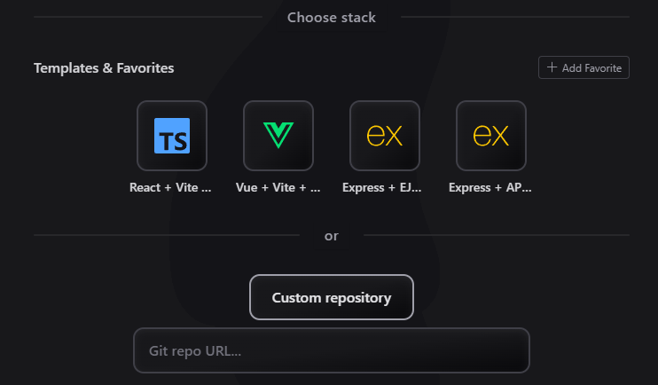
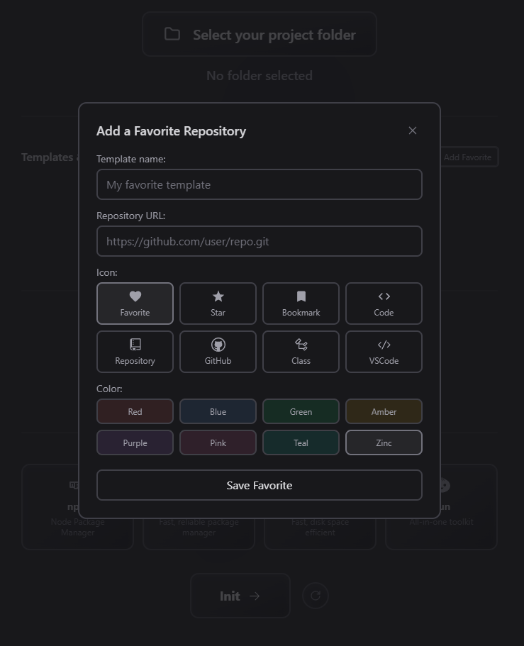
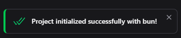

# InitMyRepo 🚀

<div align="center">
  
  <br>
  <p>
    <strong>Un gestionnaire de templates de projets élégant et efficace</strong>
  </p>
  <p>
    <a href="#aperçu-de-linterface-">Aperçu de l'interface</a> •
    <a href="#fonctionnalités-">Fonctionnalités</a> •
    <a href="#installation-">Installation</a> •
    <a href="#utilisation-%EF%B8%8F">Utilisation</a> •
    <a href="#templates-disponibles-">Templates disponibles</a> •
    <a href="#express-implementation-">Express Implementation</a> •
    <a href="#personnalisation-">Personnalisation</a>
  </p>
</div>

## Aperçu de l'interface 📱

<div align="center">
  
### Interface principale
 <br/>
*Interface moderne avec sélection de dossier, templates et gestionnaires de packages*

### Sélection de templates

 <br/>
_Templates Vite et Express disponibles avec personnalisation des favoris_

### Gestion des favoris

 <br/>
_Ajout et personnalisation de templates favoris avec icônes et couleurs_

### Processus d'initialisation

 <br/>
_Initialisation en cours avec notifications de succès/erreur_

</div></div>

## Présentation 📝

**InitMyRepo** est une application desktop élégante développée avec Electron et React qui permet d'initialiser rapidement des projets à partir de templates prédéfinis ou personnalisés. Fini les longues commandes git clone et la configuration manuelle de projets !

Avec son interface utilisateur intuitive et moderne, InitMyRepo vous permet de :

- Sélectionner un dossier de destination
- Choisir parmi une liste de templates préinstallés
- Ajouter et gérer vos propres templates favoris
- Initialiser des projets depuis n'importe quel dépôt Git
- Ouvrir directement le projet dans Visual Studio Code

## Fonctionnalités 🌟

- 🎯 **Sélection facile** : Choisissez un dossier de destination en un clic
- 📚 **Templates préinstallés** : Accédez à des templates prêts à l'emploi (Vite + Express)
- ⭐ **Gestion des favoris** : Ajoutez, personnalisez et supprimez vos propres templates
- 🔄 **Désélection par toggle** : Annulez facilement votre sélection en recliquant sur un choix
- 🖥️ **Intégration VS Code** : Ouvrez directement votre projet dans l'éditeur
- 🎨 **UI responsive** : Interface adaptée à toutes les tailles de fenêtre
- 📦 **Support multi-package managers** : npm, yarn, pnpm, bun
- ⚡ **Installation rapide** : Configuration optimisée pour des setups ultra-rapides
- 🛠️ **TypeScript ready** : Support automatique de TypeScript quand nécessaire
- 🎭 **Templates modernes** : Vite avec TailwindCSS v4, Express avec express-generator

## Installation 📦

### Prérequis

- [Git](https://git-scm.com/) installé sur votre machine
- [Node.js](https://nodejs.org/) (version 14.0.0 ou supérieure)
- [npm](https://www.npmjs.com/) (généralement installé avec Node.js)
- [VS Code](https://code.visualstudio.com/) (recommandé, mais optionnel)

### Téléchargement

1. Téléchargez la dernière version depuis la [page des releases](https://github.com/luminescencedev/InitMyRepo/releases)
2. Extrayez l'archive et lancez le programme d'installation
3. Suivez les instructions d'installation

## Utilisation ⚙️

### Étape 1: Sélectionnez un dossier de destination

Cliquez sur "Select your project folder" pour choisir l'emplacement où votre projet sera initialisé.

### Étape 2: Choisissez un template

Deux options s'offrent à vous :

1. **Templates préinstallés ou favoris** : Cliquez sur une des icônes dans la section "Templates & Favorites".
2. **Dépôt personnalisé** : Cliquez sur "Custom repository" et saisissez l'URL d'un dépôt Git.

> 💡 **Astuce** : Vous pouvez annuler votre sélection en cliquant à nouveau sur le template choisi

### Étape 3: Initialisez le projet

1. Cliquez sur le bouton "Init" pour démarrer l'initialisation
2. Une notification vous informera lorsque l'opération sera terminée
3. Cliquez sur "Open VSCode" pour ouvrir le projet dans VS Code

### Gestion des favoris

1. Cliquez sur "Add Favorite" dans la section des templates
2. Renseignez un nom, l'URL du dépôt Git, et personnalisez l'icône et la couleur
3. Cliquez sur "Save Favorite"

Pour supprimer un favori, survolez-le et cliquez sur l'icône de suppression (×).

## Templates disponibles 📋

InitMyRepo est livré avec des templates préinstallés optimisés pour différents types de projets :

### Templates Frontend (Vite)

- **React + Vite + TypeScript + TailwindCSS** : Template React moderne avec TypeScript et TailwindCSS v4
- **Vue + Vite + TypeScript + TailwindCSS** : Template Vue 3 avec TypeScript et TailwindCSS v4

### Templates Backend (Express)

- **Express + EJS (Fast Setup)** : Serveur Express avec templating EJS pour les vues (JavaScript - configuration rapide)
- **Express + API Only (Fast Setup)** : Serveur Express API pur pour REST/GraphQL (JavaScript - configuration rapide)

### Caractéristiques techniques

**Templates Vite** :

- Utilisent `create vite` avec installation automatique de TailwindCSS v4 (Vite plugin)
- Configuration TypeScript automatique
- Plus besoin de PostCSS ou Autoprefixer - TailwindCSS v4 est directement intégré comme plugin Vite
- Import simple : `@import "tailwindcss"`

**Templates Express** :

- Utilisent `express-generator` avec support des différents moteurs de vue (EJS, Pug)
- Support des preprocesseurs CSS (SASS)
- Configuration JavaScript pour un setup ultra-rapide (10-20 secondes vs 45-90 secondes)
- Support optionnel de TypeScript avec configuration automatique

Vous pouvez facilement ajouter vos propres templates personnalisés à la liste des favoris.

## Express Implementation 🚀

### Vue d'ensemble

InitMyRepo supporte maintenant Express.js avec `express-generator`, similaire aux templates Vite. Cela permet la création de projets Express en une seule commande.

### Comment ça fonctionne

#### Commandes de création de templates

L'application utilise `express-generator` avec différents gestionnaires de packages :

```bash
# NPM (défaut)
npx express-generator my-app

# Yarn
yarn create express-generator my-app

# PNPM
pnpm dlx express-generator my-app

# Bun
bunx express-generator my-app
```

#### Templates Express disponibles

1. **Express + EJS (Fast Setup)**

   - Commande : `npx express-generator --view=ejs my-app`
   - Inclut : Templating EJS, JavaScript (pas de setup TypeScript nécessaire)
   - Setup rapide pour applications web avec rendu côté serveur

2. **Express + API Only (Fast Setup)**
   - Commande : `npx express-generator --no-view my-app`
   - Inclut : Serveur API JavaScript (pas de moteur de vue, pas de setup TypeScript)
   - Parfait pour APIs REST et serveurs GraphQL avec configuration minimale

#### Structure de données

```json
{
  "name": "Express + EJS (Fast Setup)",
  "isExpressTemplate": true,
  "expressOptions": "--view=ejs",
  "useTypeScript": false,
  "description": "Express avec templating EJS (JavaScript - setup rapide)",
  "iconType": "express"
}
```

#### Support TypeScript

Les templates utilisent maintenant JavaScript pour un setup plus rapide :

- Pas de dépendances TypeScript à installer
- Pas de création de `tsconfig.json` nécessaire
- Workflow Express.js standard
- Initialisation beaucoup plus rapide (10-20 secondes vs 45-90 secondes)

### Utilisation dans InitMyRepo

1. Sélectionnez un template Express depuis le sélecteur de templates
2. Choisissez votre gestionnaire de packages préféré
3. Sélectionnez le répertoire cible
4. Cliquez sur "Initialize" - l'app gère tout :
   - Exécute `express-generator` avec les options appropriées
   - Installe les dépendances avec le gestionnaire choisi
   - Configure TypeScript si sélectionné
   - Initialise le repository git
   - Crée le commit initial

### Structure des fichiers après création

#### Template API (sans vues)

```
my-app/
├── bin/
│   └── www
├── public/
├── routes/
│   ├── index.js
│   └── users.js
├── app.js
├── package.json
└── tsconfig.json (si TypeScript)
```

#### Template Application complète (avec vues)

```
my-app/
├── bin/
│   └── www
├── public/
├── routes/
├── views/
├── app.js
└── package.json
```

### Avantages

1. **Scaffolding en une ligne** : Comme `create vite`, mais pour Express
2. **Agnostique du gestionnaire de packages** : Respecte le gestionnaire choisi par l'utilisateur
3. **Prêt pour TypeScript** : Setup automatique de TypeScript quand nécessaire
4. **TailwindCSS moderne** : Utilise TailwindCSS v4 Vite plugin pour les templates Vite
5. **Templating flexible** : Support pour divers moteurs de vue et preprocesseurs CSS
6. **Workflow cohérent** : Même interface que les templates Vite dans l'app

## Personnalisation 🎨

### Ajout de favoris personnalisés

Vous pouvez personnaliser vos templates favoris avec :

- Un nom descriptif
- Une URL de dépôt Git
- Une icône à choisir parmi plusieurs options
- Une couleur distinctive pour retrouver facilement vos templates

## Développement 👨‍💻

InitMyRepo est construit avec les technologies suivantes :

- [Electron](https://www.electronjs.org/) - Framework pour applications desktop
- [React](https://reactjs.org/) + [TypeScript](https://www.typescriptlang.org/) - Interface utilisateur
- [TailwindCSS](https://tailwindcss.com/) - Styling
- [Vite](https://vitejs.dev/) - Build tool

### Installation pour le développement

```bash
# Cloner le dépôt
git clone https://github.com/luminescencedev/InitMyRepo.git

# Accéder au répertoire du projet
cd InitMyRepo

# Installer les dépendances
npm install

# Lancer en mode développement
npm run dev
```

## Contributions

Les contributions sont les bienvenues ! N'hésitez pas à ouvrir une issue ou soumettre une pull request.

## Licence

[MIT](LICENSE) © Luminescence Dev

---

<div align="center">
  <p>Créé avec ❤️ par <a href="https://github.com/luminescencedev">Luminescence Dev</a></p>
</div>
